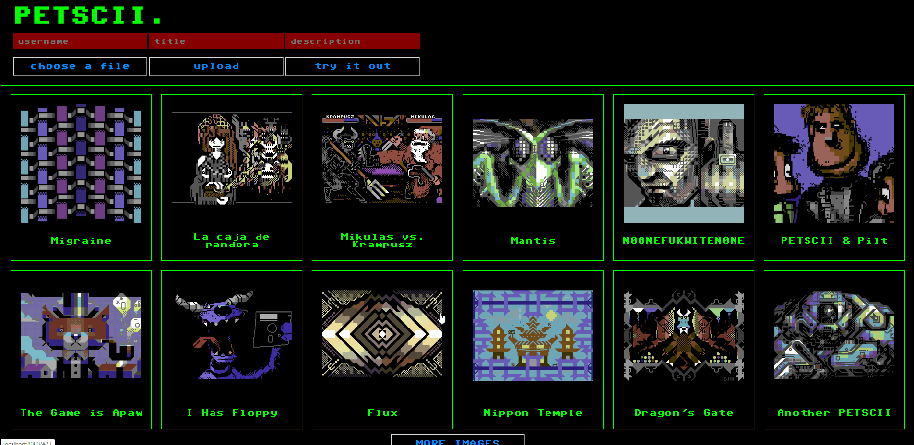

# PETSCII

"PETSCII" is a gritty 8-bit worship image board with upload and comment functionality. The project was completed in a week's time at [SPICED Academy](https://www.spiced.academy/program/full-stack-web-development/) with Vue.js being the first framework explored during the course. _Note: The project is not hosted, due to liability concerns._

---

## Siteflow

## Tech

HTML, CSS, Node.js / Express, PostgreSQL, Vue.js, AWS / S3, Multer

## Features

-   Picture upload + adding username, image title and description

-   Clicking on the thumbnail opens an overlay with a bigger version of the picture + allows adding comments for all users

## Goals while doing the project

-   Learn Vue.js implementation

-   Image upload function with Multer, AWS / S3 (images stored in an AWS bucket)

-   Comment function on every image page

-   Pagination: click on "more" button

## Credits

Images sourced via https://csdb.dk/
